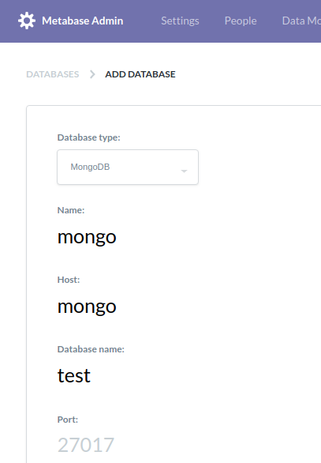
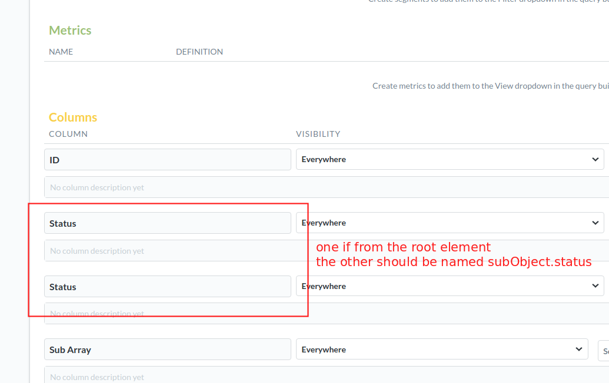

Get started
===========

```shell
docker-compose up -d
```

Then add database:
- type: mongoDB
- host: mongo
- database: test




Issue
=====

My collection holds one single document:

```json
{
    "_id": { "$oid": "5be9854e44429b000ddb94cc" },
    "status": "GENERATED_ERROR",
    "subArray": [
        {"status":"foo","bar":"test"}
    ],
    "subObject": {"status": "bar"}
}
```

In the Database Model, Metabase shows two columns named `Status`. One is from the root element `status` field, the other from the `subObject` element. How to figure out which one is which?

